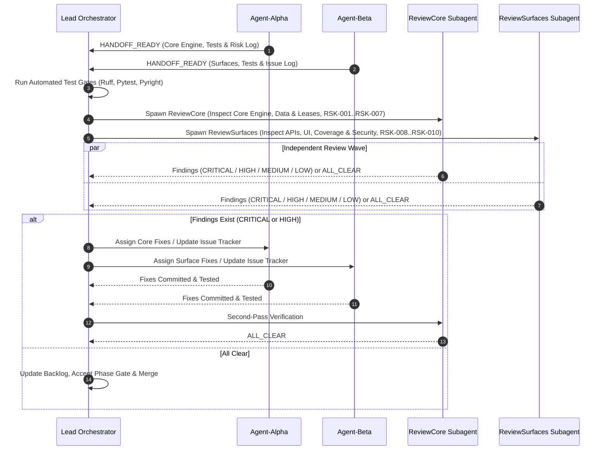

# Multi-Agent Execution, Independent Review & Communication Architecture

This document defines the operational model, communication protocols, paired workstream definitions, independent review process, risk management, issue tracking, and synchronization gates to execute the unified AI Product & Performance Scaling Architecture.

---

## 1. Operating Rules & Concurrency Envelope

In compliance with repository guidelines (`AGENTS.md`):
- **Maximum 2 Subagents Concurrently**: At no point may more than 2 subagents run simultaneously.
- **Wave-Based Execution**: Work is structured into 8 discrete sequential phases (Phase 0 through Phase 7). Each phase is divided between at most two parallel subagents:
  - `Agent-Alpha` (Worker / Engine / Data Specialist)
  - `Agent-Beta` (Integration / Surface / API & UI Specialist)
- **Independent Subagent Code Review at Phase Gates**: Before any phase is accepted, the Lead Orchestrator spawns two independent review subagents in parallel:
  - `ReviewCore` — Focuses on core engines, database transactions, concurrency leases, exception handling, data integrity, risk triggers, and LLM/embedding call contracts.
  - `ReviewSurfaces` — Focuses on API routes, workers, streaming events, retrieval queries, security/sanitization, UI integration, issue tracker status, and test coverage.
- **Durable Risk Register & Issue Tracker Maintenance**: All subagents and reviewers are mandated to actively maintain and consult `risk_register.md` and `issue_tracker_and_backlog.md`.
- **Strict Workspace Discipline**: Agents run in `inherit` or `share` mode. Shared files have clear single-owner boundaries per phase to prevent merge conflicts.
- **Authoritative Gates**: No phase is marked complete until:
  1. All unit, integration, and fault-injection tests pass on PostgreSQL.
  2. Ruff linting and formatting pass cleanly.
  3. Static type checks (`pyright`) pass.
  4. Both independent review agents issue an **"ALL CLEAR"** (or all CRITICAL and HIGH findings are resolved and re-verified).
  5. Any newly discovered issues or risk triggers are recorded in the issue tracker and risk register.

---

## 2. Multi-Agent Communication, Risk & Issue Protocols

### 2.1 Standard Message Envelope Schema
All inter-agent messages sent via `send_message` must adhere to this JSON structure:

```json
{
  "protocol_version": "1.0",
  "sender": "Agent-Alpha",
  "recipient": "Agent-Beta",
  "phase": "Phase-1",
  "message_type": "HANDOFF_READY | CONTRACT_PROPOSAL | BLOCKER | SYNC_REQUEST | REVIEW_FINDING | REVIEW_CLEAR | RISK_TRIGGER | ISSUE_LOGGED | VERIFICATION_REPORT",
  "payload": {
    "summary": "Brief explanation of handoff, finding, or status",
    "exported_symbols": ["JobQueue", "WorkItem", "ResourceAdmission"],
    "schema_revisions": ["add_processing_pipeline_tables"],
    "files_created_or_modified": [
      "services/job_queue.py",
      "alembic/versions/20260827_add_processing_pipeline.py"
    ],
    "linked_tickets": ["PT-009", "BKG-004", "BKG-005"],
    "risk_updates": [
      {
        "risk_id": "RSK-003",
        "status": "MITIGATED",
        "evidence": "DB transaction duration <= 12ms in test_job_queue.py"
      }
    ],
    "review_findings": [
      {
        "severity": "HIGH",
        "file": "services/job_queue.py",
        "line": 142,
        "issue": "Database session held during external lease check",
        "actionable_fix": "Commit transaction before invoking external resource probe"
      }
    ],
    "verification_command": ".venv/bin/pytest tests/unit/test_job_queue.py -v",
    "verification_status": "PASSED",
    "action_required": "Agent-Beta can now implement worker CLI consumers against JobQueue interface"
  }
}
```

### 2.2 Independent Subagent Review & Risk Protocol

At the conclusion of each implementation phase:



---

## 3. Comprehensive Testing Strategy

To guarantee that implementation is completely verifiable and reliable, testing is split into four distinct layers:

### 3.1 Unit Testing Layer (Isolated & Fast)
- **Schemas & Contracts**: Pydantic serialization/deserialization, quote containment against normalized transcripts, timestamp range validation (`start_seconds <= end_seconds`), evidence ID integrity (`E1`, `E2`).
- **Token Budgeting**: Input token estimation for prompts, safety margin calculation beneath the 262,144 ceiling, hierarchical chunk splitting math.
- **Batch Packing**: Nomic batch packer verifying sequence limit ($\le 32$) and aggregate token limit ($\le 8,192$).
- **Streaming Protocol**: Serialization of typed SSE events (`reasoning_delta`, `answer_delta`, `sources`, `usage`, `done`).
- **Admission Calculations**: YouTube interval (12s) + jitter (0–3s) scheduling math, exponential backoff calculation.

### 3.2 Integration Testing Layer (Disposable PostgreSQL Required)
- **Queue Atomicity**: Multi-worker concurrent claims using `FOR UPDATE SKIP LOCKED` with 100 test work items, asserting zero double claims.
- **Lease Expiry & Crash Recovery**: Simulate worker crash, verify abandoned leases expire and are safely reclaimed by surviving workers.
- **Resource Admission Leases**: Concurrently acquire batch generation leases, asserting that no more than 2 batch leases are granted and 1 interactive lease is strictly reserved.
- **Summary Runs Versioning**: Verify re-summarization creates a new version with distinct `generation_profile_hash` without overwriting prior runs.
- **Unified Index Hybrid Search**: Test pgvector cosine similarity combined with tsvector FTS using Reciprocal Rank Fusion (RRF), testing source diversity and confidence threshold filtering.
- **Admin Model Registry**: CRUD operations for endpoints, models, and profiles; runtime pool limit validation; audit logging.

### 3.3 Fault Injection & Resilience Testing Layer
- **YouTube Throttling / 429**: Simulate 429 response from yt-dlp, verify circuit breaker trips, worker enters exponential backoff, and concurrency drops to 1 (`RSK-002`).
- **LLM / SGLang Failures**: Simulate SGLang 429, 500, timeout, and malformed JSON; verify 1 bounded corrective retry is performed before marking terminal failure (`RSK-004`).
- **Embedding Failures**: Simulate partial Nomic batch failure, verify graceful batch retry (`RSK-006`).
- **DB Connection Pool Starvation**: Simulate high worker concurrency under small connection pool (`pool_size=5`), asserting that workers release connections before external calls (`RSK-003`).
- **Worker Drain & SIGTERM**: Send SIGTERM to active workers, verifying that active items finish or cleanly release leases before process exit (`RSK-007`, `RSK-010`).

### 3.4 Controlled Quality & Performance Evaluation Layer (`tests/evaluation/`)
- **Quality Evaluation Corpus**: Run on synthetic/canonical test videos (short, long, technical, multi-speaker, contradictory).
- **Metrics Evaluated**:
  - *Factual Consistency*: Zero hallucinations; all material claims mapped to valid `E1` evidence IDs.
  - *Quotation Precision*: 100% of quote excerpts match transcript text verbatim.
  - *Reasoning Comparison*: Benchmark Direct, Low, Medium, and Deep modes on identical videos, measuring TTFT, total latency, reasoning tokens, and answer quality.
  - *Interactive Responsiveness*: Execute video chat while 2 batch summary workers run, asserting interactive request latency is unaffected (`RSK-001`).

---

## 4. Phased Paired Workstream Breakdown

```text
Phase 0: [Alpha: Schemas, Types & Runtime Probes]      || [Beta: App Config, Flags & Test Fixtures]
         └── Gate 0: Tests + Risk & Issue Check + Independent Review (ReviewCore & ReviewSurfaces)
Phase 1: [Alpha: Alembic Queue Schema & JobQueue]      || [Beta: Resource Admission & Worker CLI]
         └── Gate 1: Tests + Risk & Issue Check + Independent Review (ReviewCore & ReviewSurfaces)
Phase 2: [Alpha: Transcript Segments & Direct Ingest]   || [Beta: Pacing, Circuit Breaker & Worker Stage]
         └── Gate 2: Tests + Risk & Issue Check + Independent Review (ReviewCore & ReviewSurfaces)
Phase 3: [Alpha: 9-Section Summary Engine & SGLang]     || [Beta: Summary Worker & Gen Admission]
         └── Gate 3: Tests + Risk & Issue Check + Independent Review (ReviewCore & ReviewSurfaces)
Phase 4: [Alpha: Nomic Batch Packer & Worker]           || [Beta: Content Chunks Index & Schema Bridge]
         └── Gate 4: Tests + Risk & Issue Check + Independent Review (ReviewCore & ReviewSurfaces)
Phase 5: [Alpha: Chat Persistence & Hybrid Retrieval]   || [Beta: Admin Model Registry & Qualification]
         └── Gate 5: Tests + Risk & Issue Check + Independent Review (ReviewCore & ReviewSurfaces)
Phase 6: [Alpha: Next.js 9-Section Summary & Timeline]  || [Beta: Next.js Chat, Thinking & Registry UI]
         └── Gate 6: Tests + Risk & Issue Check + Independent Review (ReviewCore & ReviewSurfaces)
Phase 7: [Alpha: Worker Compose Topology & Autoscaler]  || [Beta: Evaluation Corpus & Redis Removal]
         └── Gate 7: Final Comprehensive Gate + Risk & Issue Closeout + Independent Review
```

---

## 5. Review & Testing Gate Verification Command Suite

At each phase gate, the following sequence is executed:

```bash
# 1. Formatting and linting
.venv/bin/ruff check . && .venv/bin/ruff format --check .

# 2. Fast unit tests
.venv/bin/pytest tests/unit/ -v

# 3. PostgreSQL integration tests (if disposable PostgreSQL available)
TEST_DATABASE_URL=$DB_URL .venv/bin/pytest tests/integration/ -v

# 4. Type checking
.venv/bin/pyright

# 5. Frontend lint and build (Phases 6 & 7)
cd frontend && npm run lint && npm run build
```
